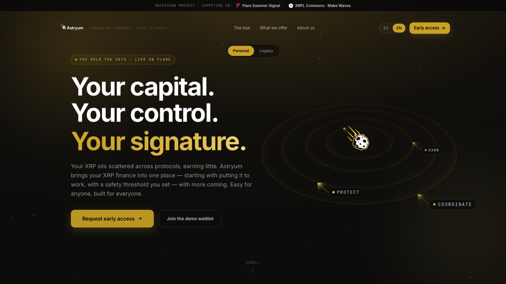
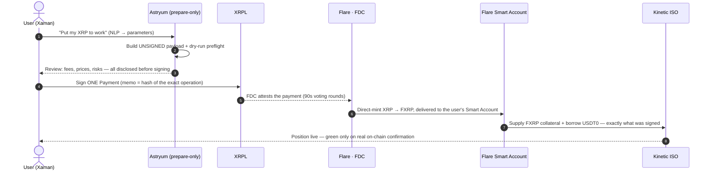
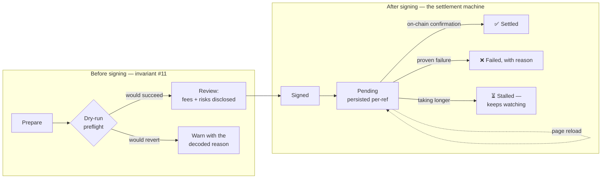
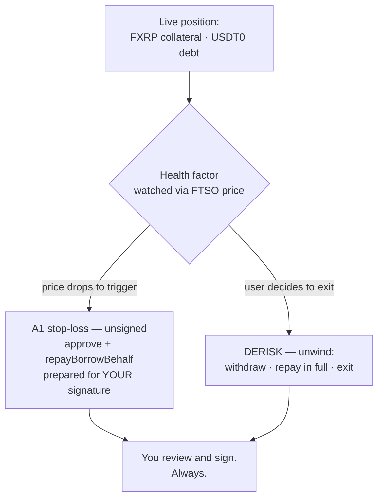
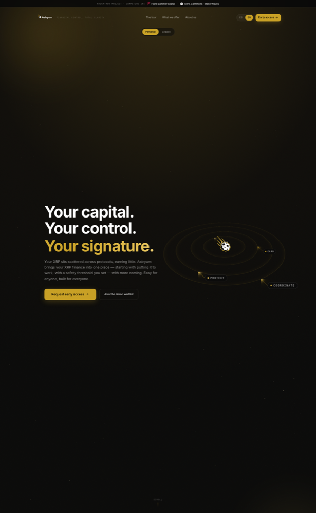

# Astryum

**Your capital. Your control. Your signature.**

A **non-custodial financial control plane** on Flare + XRPL. Astryum observes capital across
wallets, aggregates it into one dashboard, and **prepares unsigned transactions** for the user
to sign in their own wallet (Xaman for XRPL, MetaMask/WalletConnect for EVM).

**Astryum never signs, never custodies funds, never executes with discretion.**
That line is enforced in code — see [INVARIANTS.md](INVARIANTS.md) and the boot guards in
`backend/src/config/bootGuards.ts`.

### 🚀 [**Try it live → astryum.xyz**](https://astryum.xyz)

*The product runs on **Flare Mainnet**. Everything below is best experienced from the page —
request early access there; this repository is for reading the code, not for running it.*

 

> This repository is the **public snapshot** of the Astryum monorepo (`main`): the full product
> code with its canonical docs. Internal working notes (`docs/context/`, `legal/`) and the
> pruned demo build live in the private repository and are occasionally referenced by name for
> traceability. Built for **Flare Summer Signal** and **XRPL Commons · Make Waves**.

---

## The flagship flow — Carry FXRP, one signature in Xaman

An XRP holder enters DeFi on Flare **without an EVM wallet and without gas**: one XRPL Payment,
signed in Xaman, carries a Smart Account instruction (`0xFE`) whose hash pins exactly what may
execute — nothing else can.

Every `/prepare` response carries a fee/price disclosure with `disclosedToUser: true` and
`defibroSigns: false` — and the backend refuses to boot if any environment variable looks
like a user signing key (`backend/src/config/bootGuards.ts`).

## Truth before and after the signature

The two halves of the product's honesty, both machine-enforced:

- **Preflight on all six flagship `/prepare` routes** (`e1`, `e1-borrow`, `supply-usdt0`, `a1`,
  `pa-repay`, `pa-withdraw-transfer`): each operation is simulated against live chain state
  before the wallet ever opens — a doomed transaction warns *before* it costs anything.
- **The UI cannot fabricate success**: the settled state is produced only by the settlement
  machine from real confirmations (a branded type makes a hand-built "green" impossible), a
  signed operation **survives a page reload**, and the "taking longer than usual" threshold is
  **calibrated against 166 real mainnet direct-mint executions** (median 129s, max 239s —
  measured from the FDC proofs themselves, see `frontend/src/lib/settlement/settlement.ts`).

## Protection is part of the strategy, not an afterthought

Automation only ever **prepares**; triggers compile to deterministic intents the user signed
policies for. No agent, no operator, and no Astryum key can move capital on its own.

## What Flare does here (and why it is load-bearing)

| Primitive | Role in Astryum | If you removed it |
|---|---|---|
| **Flare Smart Accounts** (`0xFE` custom instruction) | An XRPL signature controls DeFi actions on Flare — no EVM wallet, no gas for the user | The walletless XRP user stops existing |
| **FAssets / FXRP** (direct-mint) | Native XRP becomes productive collateral on Flare in the same signed flow | No XRP entry path at all |
| **FDC** | Attests the XRPL payment; the mint executes only against that proof | The trustless rail collapses |
| **FTSO** | Live prices size the borrow and drive the stop-loss math (`FTSO_PRICE_UNAVAILABLE` fails closed) | Protection would run on stale numbers |

## See it

| The trust page — verifiable claims, not promises | The journey |
|:---:|:---:|
|  |  |

Every surface ships in English and Spanish (Spanish-first at home, by design).

## What existed vs. what is new (for judges)

- **Pre-hackathon:** the canonical intent core (PolicyGuard, CalldataBuilder, IntentEngine),
  the multi-wallet read layer, auth (SIWE + passkey), i18n, the adapter registry.
- **Built for this demo:** the Carry FXRP strategy end-to-end (FlareDirectMintService,
  Flare Smart Account `0xFE` userOps, Kinetic ISO builders + math, the flare-demo prepare
  routes, the Strategy screen with the NLP compile), the unified dashboard, the DERISK
  shortfall disclosure, the settlement machine and the preflight layer.
- Runs on **Flare Mainnet** (chain 14) with verified contract addresses
  (`backend/.env.example`). Covered by **1,400+ automated tests** (backend Jest + frontend
  Vitest) with TypeScript strict typechecks at zero errors on both sides.

## Repo map

- `frontend/src/app` — the app surfaces (Summary · Strategy · Portfolio · Wallets · Intents ·
  Legacy · Admin · Settings…) plus landing and auth.
  `frontend/src/components/earn/FlareDemoEarn.tsx` is the Strategy UI;
  `frontend/src/lib/settlement/` is the post-signature settlement machine.
- `backend/src/routes` — the API routers; `flareDemo.ts` holds the prepare endpoints above.
- `backend/src/connectors/protocols/flare` — FAssets direct-mint, Smart Accounts, Kinetic math.
- `backend/src/control-plane` — PolicyGuard + CalldataBuilder (the invariant tree).
- Canonical docs: [ARCHITECTURE.md](ARCHITECTURE.md) · [DECISIONS.md](DECISIONS.md) ·
  [INVARIANTS.md](INVARIANTS.md) ·
  [Astryum_Strategy_Carry_FXRP_Spec.md](Astryum_Strategy_Carry_FXRP_Spec.md) ·
  [docs/regulatory/MICA_BOUNDARIES.md](docs/regulatory/MICA_BOUNDARIES.md).

---

**[astryum.xyz](https://astryum.xyz)** — your capital, your control, your signature.

